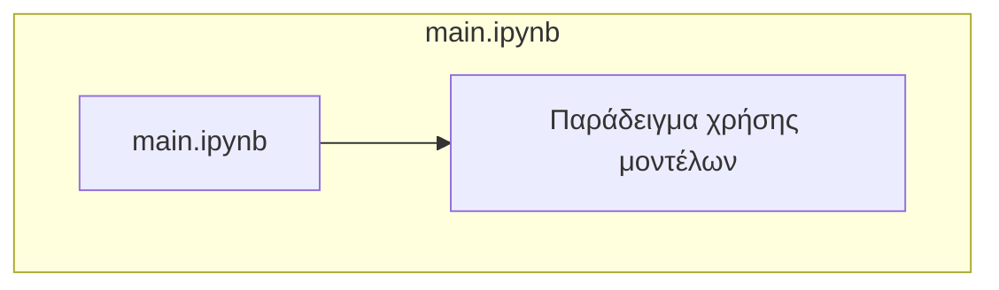
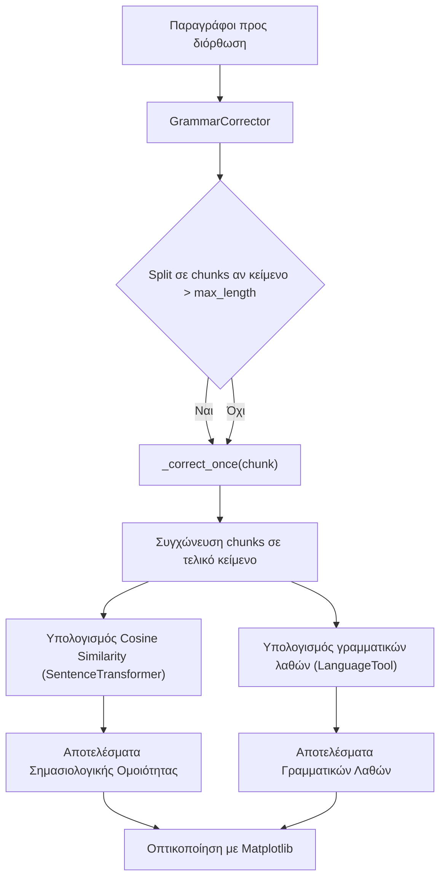
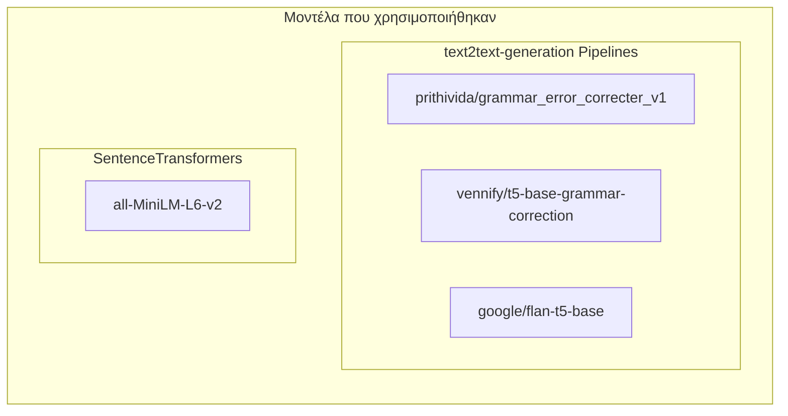
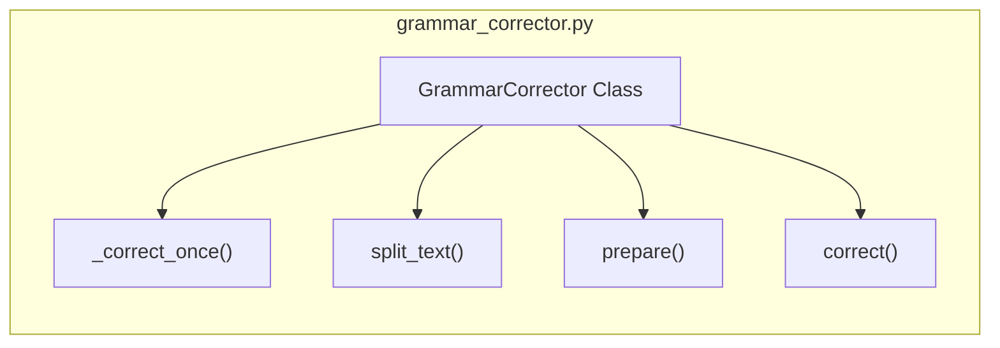
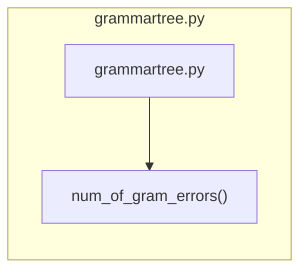
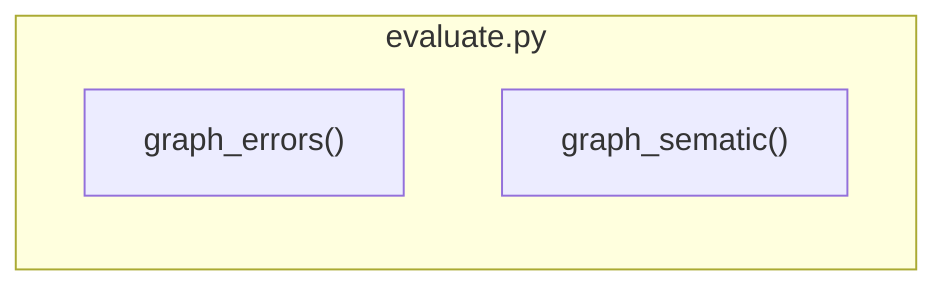

>## Tech Stack & Tools

- **Python 3.10** 
- **Jupyter Notebooks** (Interactive code and notes)
- **NLTK**, **stanza**, **transformers**,**anytree**,**grammartree**, **PyTorch**, **Poetry** (for dependency management)
- **Hugging Face** (for specific use cases)

>### Clone the repository:
```bash
git clone https://github.com/dimitris1pana/nlp_lab_unipi
```
>## Made by: 
**Lampros Koukoulis p18081**

## Ανακατασκευή Κειμένου με NLP's για την αντιπετώπιση ασάφειας και γραμματικών λαθών

## Περιγραφή Εργασίας

Η εργασία αφορά την **αυτόματη διόρθωση γραμματικών λαθών σε κείμενα** και την **αξιολόγηση των αποτελεσμάτων** χρησιμοποιώντας διαφορετικά μοντέλα μετασχηματιστών **text2text generation**.

Ο σκοπός είναι:
- Διορθώνονται γραμματικά λάθη
- Μετράμε τη σημασιολογική ομοιότητα (semantic-cosine similarity)
- Αξιολογούμε τη βελτίωση μέσω γραμματικών λαθών
- Παρουσιάζουμε τα αποτελέσματα σε γραφήματα

---
# Α. Aνακατασκευή 2 προτάσεων της επιλογής σας με αυτόματο που θα διαμορφώσετε εσείς 
## Δομή και Ροή του Κώδικα
>### **main**

H main χρησιμοποιείται για την αλληλεπίδραση με τις κλάσεις και τις μεθόδους που αναπτύχθηκαν.

Η γραμματική σχεδιάστηκε με τα εξής κριτήρια:
* Ουσιαστικά (N)
* Ρήματα (V)
* Αντωνυμίες (PRONOUN)
* Άρθρα (DET)
* ΕΠίθετα (ADJ)
* Προθέσεις (PREP)

Η γραμματική ορίστηκε με την βιβλιοθήκη nltk
```python
import nltk
grammar = nltk.CFG.fromstring("""
    S -> NP VP | VP
    NP -> PRONOUN |DET N | DET ADJ N | PRONOUN N |PRONOUN ADJ N
    VP -> V NP | V | V INF | V NP INF | V PP | V NP PP
    PP -> PREP NP
    INF -> 'to' V | 'to' V NP                                                            
    DET -> 'the' | 'a' | 'this'
    PRONOUN -> 'I' | 'you' | 'my'
    ADJ -> 'deepest' | 'approved'
    N -> 'message' | 'wishes'
    V -> 'hope' | 'enjoy' | 'got' | 'see'
    PREP -> 'to'
""")

parser = nltk.ChartParser(grammar)
```
>### Παράδειγμα εισόδου
```python
sentences = [
    ["hope", "you","to", "enjoy", "my", "deepest", "wishes"],
    ["I","got","this","message","to","see","the","approved","message"]
]
```
Χρησιμοποιώντας το parser.parse() παράγεται δέντρο συντακτικής ανάλυσης. Τα εμφανίζουμε με την pretty_print() 
```python
for sentence in sentences:
    for tree in parser.parse(sentence):
        tree.pretty_print()
```
>### Αποτελέσματα
```
Printing tree for sencence: :hope you to enjoy my deepest wishes
                   S                         
                   |                          
                   VP                        
  _________________|______                    
 |      |                INF                 
 |      |      ___________|_______            
 |      NP    |    |              NP         
 |      |     |    |       _______|______     
 V   PRONOUN  |    V   PRONOUN   ADJ     N   
 |      |     |    |      |       |      |    
hope   you    to enjoy    my   deepest wishes


Printing tree for sencence: :I got this message to see the approved message
             S                                           
    _________|________________                            
   |                          VP                         
   |      ____________________|_______                    
   |     |        |                  INF                 
   |     |        |            _______|_____              
   NP    |        NP          |   |         NP           
   |     |    ____|_____      |   |    _____|________     
PRONOUN  V  DET         N     |   V  DET   ADJ       N   
   |     |   |          |     |   |   |     |        |    
   I    got this     message  to see the approved message
```

> # Β.Ανακατακευή Κειμένων με NLP Pipelines
Η ιδέα που ακολούθησα για την ανακατασκευή περιγράφεται απο το παρακάτω διάγραμμα ροής.

>## Μοντέλα που χρησιμοποιήθηκαν


```python
models ={"prithivida":GrammarCorrector(model_name="prithivida/grammar_error_correcter_v1"),
         "vennify":GrammarCorrector(model_name="vennify/t5-base-grammar-correction"),
         "flan-t5":GrammarCorrector(model_name="google/flan-t5-base", use_prompt=True)}
```
Και βάση αυτών παράχθηκαν αποτελέσματα.
```python
result_text ={model_name: [] for model_name in models}
sematic_results = {model_name: [] for model_name in models}

for p in paragraphs:
    for model_name,gc in models.items():
        output,score = gc.correct(p)
        result_text[model_name].append(output)
        sematic_results[model_name].append(score)
        print(f"{'='*120}\n{gc.model_name}\t|\t Scematic Score: {score}\n{'='*120}")
        print("\n".join(textwrap.wrap(output,width=120))+"\n")
```
# Συγκρίνετε τα αποτελέσματα της κάθε προσέγγισης με τις κατάλληλες τεχνικές
```python
import evaluate

evaluate.graph_errors(models,paragraphs,result_text)
evaluate.graph_sematic(models,paragraphs,sematic_results)
```
### **GrammarCorrector**
Χρησιμοποιήθηκε μοντέλο SentenceTranformer για να παραγθούν διανύσματα συσχέτισης  μεταξύ των λέξεων ώστε να μπορεί να αξιολογηθεί τελικά η όποια τροποποίηση έγινε στις παραγράφους.

` encoder = SentenceTransformer("all-MiniLM-L6-v2")`

```python
def embed(text):
    return encoder.encode(text)
```
### Υπολογισμός Σημασιολογίκης Ομοιότητας (sematic_similarity)
```python
def sematic_similarity(v1,v2):
    embedv1 = embed(v1)
    embedv2 = embed(v2)
    return np.dot(embedv1,embedv2)/(np.linalg.norm(embedv1)*np.linalg.norm(embedv2))
```
Υπολογίζει το cosine similarity μεταξύ:
- αρχικού κειμένου
- διορθωμνένου κειμένου

>### Κλάση **GrammarCorrector**

```python
def __init__(self,model_name,max_length,use_prompt):
```
#### Φόρτωση Pipeline
```python
self.pipe = pipeline(
    "text2text-generation",
    model=self.model_name,
    device= device
)
```
- Συμβατό και με το google/flan-t5-base

Μπορούμε να δώσουμε και άλλες στο τελικο pipeline
```python
out = self.pipe(
    text,
    max_new_tokens=256,                 #Limits the number of tokens the 
                                        # model can generate in addition to the input
    truncation=False,                   #tuncation = false throws error if input exeeds 
                                        # models maximun input length
    clean_up_tokenization_spaces=True,  #Removes exrta spaces 
    do_sample = False,                  #Deterministic output and not creative 
                                        # based of sampled tokens 
    num_beams = 4,                      #number of alternative outputs the model creates. 
    repetition_penalty = 1.3,           #penalty for repeating the same token 
    )
```
Στην περίπτωση του **google/flan-t5-base** πρέπει να αναφέρουμε στο pipeline τι θέλουμε να κάνουμε με την χρήση prompt, όπως:
```python
    def prepare(self,text) -> str:
        '''Prepares text by adding prompt if required'''
        if self.use_prompt:
            return f"Rewrite the following text to be grammatically correct, concise, and without repetition.Do not add new information:\n{text}"
        return text
```
Επιπλέον, πρίν εκτελέσουμε κάποιο pipeline γίνεται έλεγχος για το μέγεθος του κειμένου, καθώς τα pipelines έχουν ορισμένο όριο εισόδου. 

```python
def split_text(self,text: str) -> list[str]:
        words = text.split()
        chunks = []
        current= ""

        for word in words:
            if len(current) + len(word) + 1 <self.max_length:
                current += word + " "
            else:
                chunks.append(current.strip())
                current= word + " "
        
        if current:
            chunks.append(current.strip())
        return chunks
```
Έτσι χρησιμοποιώντας την μέθοδο correct
```python
 def correct(self, text:str) -> tuple[str,float]:
        '''
        Correct the full text:        
        -   Split into chunks if text is too big
        -   Correct each chuck indepentently
        -   Returns corrected text and sematic similarity score
        '''
        if len(text) <= self.max_length:
            chunks =[text]
        else:
            chunks = self.split_text(text)
        
        corrected_chunks = []
        for chunk in chunks:
            current= chunk
            candidate = self._correct_once(current)
            current = candidate
            corrected_chunks.append(current)

        final =" ".join(corrected_chunks)
        score = sematic_similarity(text, final)
        return final,score
```
- Γίνονται όλοι οι απαραίτητοι ελέγχοι
  - Διάσπαση του κειμένου σε chunks αν χρειάζεται 
  - Προσθήκη prompt
- Υπολογίζεται το sematic similarity 
- Επιστρέφει το αποτέλεσμα του pipeline και το sematic_score

>### **grammartree**

Με την μέθοδο num_of_gram_errors μέσω της language_tool_python ελέγχουμε το πλήθος των σφαλμάτων που εμπεριέχονται σε 2 κείμενα. 
```python
def num_of_gram_errors(original:str,corrected:str)-> tuple[int,int]:
    tool = language_tool_python.LanguageTool("en-US")
    errors_original = len(tool.check(original))
    errors_corrected = len(tool.check(corrected))
    print(f"In original Text: {errors_original}\tIn Corrected Text: {errors_corrected}")
    tool.close()
    return errors_original, errors_corrected
```
>### **evaluate**

Το αρχείο evaluate περιλαμβάνει matplotlib.pyplot figures για την οπτικοποίηση των αποτελεσμάτων 
#### Sematic Similarity Evaluation


#### Grammatical Errors Evaluation

---


>## Citations:
- Yadav, A., Patel, A., & Shah, M. (2021). A comprehensive review on resolving ambiguities in natural language processing. AI Open, 2, 85–92. https://doi.org/10.1016/j.aiopen.2021.05.001
  ### Batch proccessing
- https://colab.research.google.com/gist/pszemraj/6e961b08970f98479511bb1e17cdb4f0/batch-grammar-check-correct-demo.ipynb
  ### Pipelines
- https://huggingface.co/docs/transformers/main/en/pipeline_tutorial#pipeline
  ### Tokenize and epoch training
- https://blog.stackademic.com/fine-tuning-t5-for-grammar-correction-a-step-by-step-guide-edba96ada787
  ### Trainig using t5
- https://huggingface.co/google-t5/t5-base
- https://huggingface.co/learn/llm-course/chapter2/4
