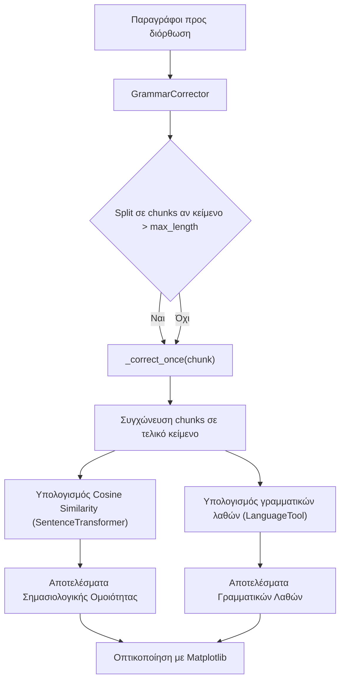
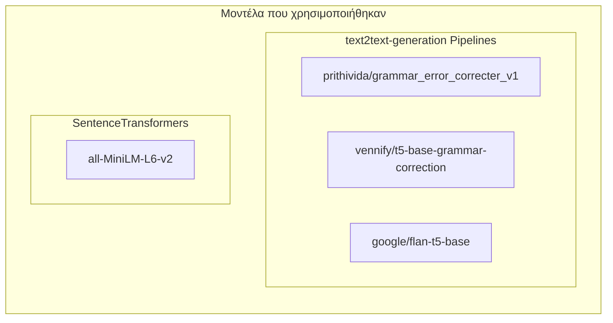
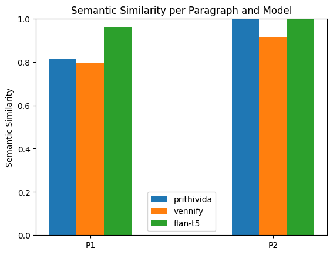
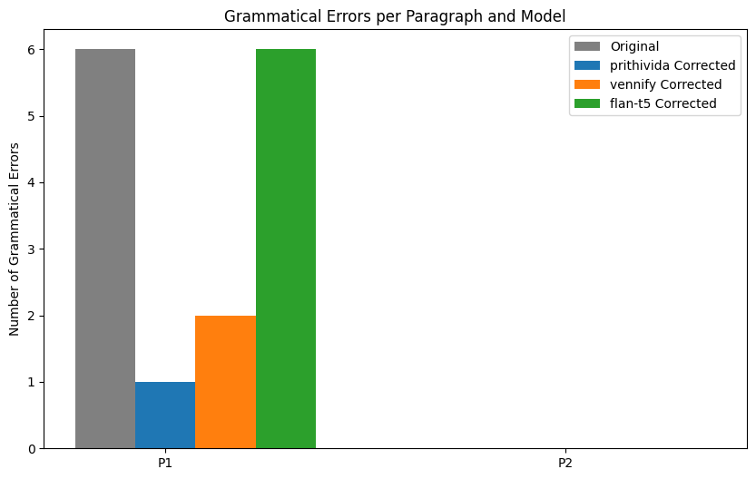
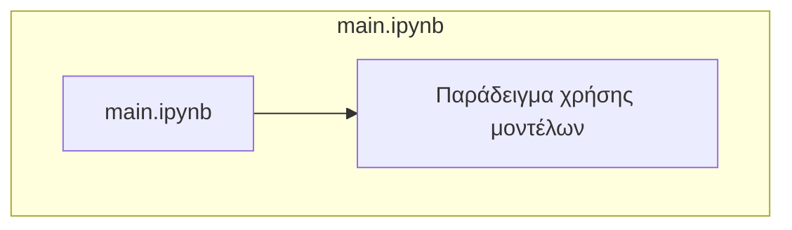
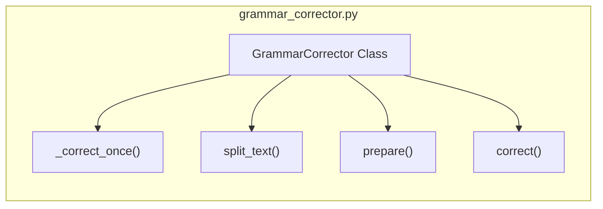
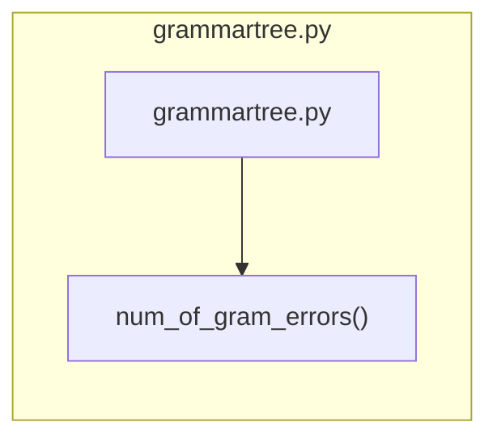
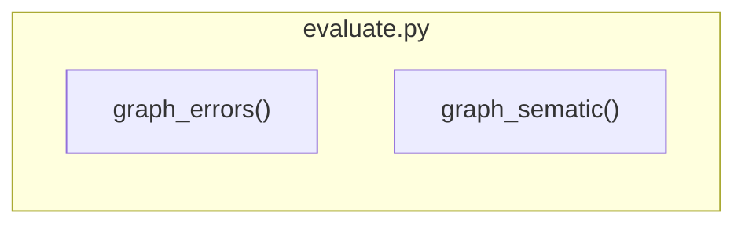

># Ευρετήριο- 
- [Eισαγωγή](#eισαγωγή)
  - [Clone the repository:](#clone-the-repository)
  - [Περιγραφή Εργασίας](#περιγραφή-εργασίας)
- [Παραδοτέο 1: Ανακατασκευή Κειμένου](#παραδοτέο-1-ανακατασκευή-κειμένου)
  - [Α. Aνακατασκευή 2 προτάσεων της επιλογής σας με αυτόματο που θα διαμορφώσετε εσείς](#α-aνακατασκευή-2-προτάσεων-της-επιλογής-σας-με-αυτόματο-που-θα-διαμορφώσετε-εσείς)
    - [Αποτελέσματα](#αποτελέσματα)
  - [Β. Ανακατακευή Κειμένων με NLP Pipelines](#β-ανακατακευή-κειμένων-με-nlp-pipelines)
    - [Μοντέλα που χρησιμοποιήθηκαν](#μοντέλα-που-χρησιμοποιήθηκαν)
  - [C. Συγκρίνετε τα αποτελέσματα της κάθε προσέγγισης με τις κατάλληλες τεχνικές](#c-συγκρίνετε-τα-αποτελέσματα-της-κάθε-προσέγγισης-με-τις-κατάλληλες-τεχνικές)
    - [Sematic Similarity Evaluation](#sematic-similarity-evaluation)
    - [Grammatical Errors Evaluation](#grammatical-errors-evaluation)
- [Παραδοτέο 2: Υπολογιστική Ανάλυση](#παραδοτέο-2-υπολογιστική-ανάλυση)
  - [Δικές σας -custom- αυτόματες ροές εργασίας NLP (προεπεξεργασία, λεξιλόγιο, ενσωμάτωση λέξεων, εννοιολογικά δέντρα κλπ)](#δικές-σας--custom--αυτόματες-ροές-εργασίας-nlp-προεπεξεργασία-λεξιλόγιο-ενσωμάτωση-λέξεων-εννοιολογικά-δέντρα-κλπ)
- [Παραδοτέο 3: Δομημένη Αναφορά](#παραδοτέο-3-δομημένη-αναφορά)
  - [Εισαγωγή](#εισαγωγή)
  - [Μεθοδολογία](#μεθοδολογία)
    - [main](#main)
    - [GrammarCorrector.py](#grammarcorrectorpy)
      - [Υπολογισμός Σημασιολογίκης Ομοιότητας (sematic\_similarity)](#υπολογισμός-σημασιολογίκης-ομοιότητας-sematic_similarity)
    - [Κλάση GrammarCorrector](#κλάση-grammarcorrector)
      - [Φόρτωση Pipeline](#φόρτωση-pipeline)
    - [grammartree](#grammartree)
    - [evaluate](#evaluate)
  - [Πειράματα \& Αποτελέσματα:](#πειράματα--αποτελέσματα)
    - [Sematic Similarity Evaluation](#sematic-similarity-evaluation-1)
    - [Grammatical Errors Evaluation](#grammatical-errors-evaluation-1)
  - [Συζήτηση \& Συμπεράσματα](#συζήτηση--συμπεράσματα)
    - [Πόσο καλά αποτύπωσαν οι ενσωματώσεις λέξεων (embeddings) το νόημα;](#πόσο-καλά-αποτύπωσαν-οι-ενσωματώσεις-λέξεων-embeddings-το-νόημα)
    - [Ποιες ήταν οι μεγαλύτερες προκλήσεις στην ανακατασκευή;](#ποιες-ήταν-οι-μεγαλύτερες-προκλήσεις-στην-ανακατασκευή)
    - [Πώς μπορεί να αυτοματοποιηθεί αυτή η διαδικασία χρησιμοποιώντας μοντέλα NLP;](#πώς-μπορεί-να-αυτοματοποιηθεί-αυτή-η-διαδικασία-χρησιμοποιώντας-μοντέλα-nlp)
    - [Υπήρξαν διαφορές στην ποιότητα ανακατασκευής μεταξύ τεχνικών, μεθόδων, βιβλιοθηκών κλπ;](#υπήρξαν-διαφορές-στην-ποιότητα-ανακατασκευής-μεταξύ-τεχνικών-μεθόδων-βιβλιοθηκών-κλπ)
  - [Βιβλιογραφία:](#βιβλιογραφία)
    - [Batch proccessing](#batch-proccessing)
    - [Pipelines](#pipelines)
    - [Tokenize and epoch training](#tokenize-and-epoch-training)
    - [Trainig using t5](#trainig-using-t5)

# Eισαγωγή
>## Tech Stack & Tools

- **Python 3.10** 
- **Jupyter Notebooks** (Interactive code and notes)
- **NLTK**, **stanza**, **transformers**,**anytree**,**grammartree**, **PyTorch**, **Poetry** (for dependency management)
- **Hugging Face** (for specific use cases)

## Clone the repository:
```bash
git clone https://github.com/LamprosKoukoulis/nlp
```
>## Made by: 
**Lampros Koukoulis p18081**

## Περιγραφή Εργασίας

Η εργασία αφορά την **αυτόματη διόρθωση γραμματικών λαθών σε κείμενα** και την **αξιολόγηση των αποτελεσμάτων** χρησιμοποιώντας διαφορετικά μοντέλα μετασχηματιστών **text2text generation**.

Ο σκοπός είναι:
- Διορθώνονται γραμματικά λάθη
- Μετράμε τη σημασιολογική ομοιότητα (semantic-cosine similarity)
- Αξιολογούμε τη βελτίωση μέσω γραμματικών λαθών
- Παρουσιάζουμε τα αποτελέσματα σε γραφήματα

---
# Παραδοτέο 1: Ανακατασκευή Κειμένου
## Α. Aνακατασκευή 2 προτάσεων της επιλογής σας με αυτόματο που θα διαμορφώσετε εσείς

Η γραμματική σχεδιάστηκε με τα εξής κριτήρια:
* Ουσιαστικά (N)
* Ρήματα (V)
* Αντωνυμίες (PRONOUN)
* Άρθρα (DET)
* ΕΠίθετα (ADJ)
* Προθέσεις (PREP)

Η γραμματική ορίστηκε με την βιβλιοθήκη nltk
```python
import nltk
grammar = nltk.CFG.fromstring("""
    S -> NP VP | VP
    NP -> PRONOUN |DET N | DET ADJ N | PRONOUN N |PRONOUN ADJ N
    VP -> V NP | V | V INF | V NP INF | V PP | V NP PP
    PP -> PREP NP
    INF -> 'to' V | 'to' V NP                                                            
    DET -> 'the' | 'a' | 'this'
    PRONOUN -> 'I' | 'you' | 'my'
    ADJ -> 'deepest' | 'approved'
    N -> 'message' | 'wishes'
    V -> 'hope' | 'enjoy' | 'got' | 'see'
    PREP -> 'to'
""")

parser = nltk.ChartParser(grammar)
```
>### Παράδειγμα εισόδου
```python
sentences = [
    ["hope", "you","to", "enjoy", "my", "deepest", "wishes"],
    ["I","got","this","message","to","see","the","approved","message"]
]
```
Χρησιμοποιώντας το parser.parse() παράγεται δέντρο συντακτικής ανάλυσης. Τα εμφανίζουμε με την pretty_print() 
```python
for sentence in sentences:
    for tree in parser.parse(sentence):
        tree.pretty_print()
```
### Αποτελέσματα
```
Printing tree for sencence: :hope you to enjoy my deepest wishes
                   S                         
                   |                          
                   VP                        
  _________________|______                    
 |      |                INF                 
 |      |      ___________|_______            
 |      NP    |    |              NP         
 |      |     |    |       _______|______     
 V   PRONOUN  |    V   PRONOUN   ADJ     N   
 |      |     |    |      |       |      |    
hope   you    to enjoy    my   deepest wishes


Printing tree for sencence: :I got this message to see the approved message
             S                                           
    _________|________________                            
   |                          VP                         
   |      ____________________|_______                    
   |     |        |                  INF                 
   |     |        |            _______|_____              
   NP    |        NP          |   |         NP           
   |     |    ____|_____      |   |    _____|________     
PRONOUN  V  DET         N     |   V  DET   ADJ       N   
   |     |   |          |     |   |   |     |        |    
   I    got this     message  to see the approved message
```

## Β. Ανακατακευή Κειμένων με NLP Pipelines
Η ιδέα που ακολούθησα για την ανακατασκευή περιγράφεται απο το παρακάτω διάγραμμα ροής.

### Μοντέλα που χρησιμοποιήθηκαν


```python
models ={"prithivida":GrammarCorrector(model_name="prithivida/grammar_error_correcter_v1"),
         "vennify":GrammarCorrector(model_name="vennify/t5-base-grammar-correction"),
         "flan-t5":GrammarCorrector(model_name="google/flan-t5-base", use_prompt=True)}
```
Και βάση αυτών παράχθηκαν αποτελέσματα.
```python
result_text ={model_name: [] for model_name in models}
sematic_results = {model_name: [] for model_name in models}

for p in paragraphs:
    for model_name,gc in models.items():
        output,score = gc.correct(p)
        result_text[model_name].append(output)
        sematic_results[model_name].append(score)
        print(f"{'='*120}\n{gc.model_name}\t|\t Scematic Score: {score}\n{'='*120}")
        print("\n".join(textwrap.wrap(output,width=120))+"\n")
```
## C. Συγκρίνετε τα αποτελέσματα της κάθε προσέγγισης με τις κατάλληλες τεχνικές
```python
import evaluate

evaluate.graph_errors(models,paragraphs,result_text)
evaluate.graph_sematic(models,paragraphs,sematic_results)
```
### Sematic Similarity Evaluation


### Grammatical Errors Evaluation

# Παραδοτέο 2: Υπολογιστική Ανάλυση
## Δικές σας -custom- αυτόματες ροές εργασίας NLP (προεπεξεργασία, λεξιλόγιο, ενσωμάτωση λέξεων, εννοιολογικά δέντρα κλπ)

Στο πλαίσιο της εργασίας επιχειρήθηκε η υλοποίηση μιας **custom αυτόματης ροής εργασίας NLP** για γραμματική διόρθωση, χωρίς τη χρήση έτοιμων text2text transformer pipelines. Η προσέγγιση βασίστηκε αποκλειστικά στο εργαλείο **LanguageTool** και σε επαναληπτική διόρθωση λαθών.
```python
def check_grammar(text:str):
    tool = language_tool_python.LanguageTool("en-US")
    is_bad_rule = lambda rule: rule.message == 'Possible spelling mistake found.' and len(rule.replacements) and rule.replacements[0][0].isupper()
    corrected_text = text
    count =0
    while True:
        count+=1
        matches= tool.check(corrected_text)
        matches = [rule for rule in matches if not is_bad_rule(rule)]

        if not matches:
            break

        for match in sorted(matches,key=lambda m: m.offset,reverse=True):
            if match.replacements:
                replacement = match.replacements[0]
                start,end= match.offset, match.offset + match.errorLength
                corrected_text = corrected_text[:start] + replacement + corrected_text[end:]
    tool.close()
    #print("Original text:", text)
    print("Corrected text:\n", corrected_text)
    print("Number of iterations:",count)
    #print("Grammar issues found:", len(matches))

    return matches
```
H συνάρτηση check_grammar:
- Ελέγχει το κείμενο για γραμματικά λάθη
- Φιλτράρει βάση του is_bad_rule
- Εφαρμόζει επαναληπτικά διορθώσεις μέχρις ότου να μην εμφανίζονται άλλα λάθη.
- Εμφανίζει το διορθωμένο κείμενο και τον αριθμό των επαναλήψεων
- Επιτρέφει τους γραμματικούς κανόνες που χρησιμοποίηθηκαν

Παρόλα αυτά δεν απέδωσε ικανοποιητικά αποτελέσματα καθώς:
- Δεν λαμβάνει υπόψην την σημασιολογική συνοχή του κειμένου.
- Εφαρμόζει τοπικές διορθώσεις που αλλοιώνουν την φυσική ροή του κειμένου.

Για αυτούς τους λόγους δεν συνεχίστηκε την ανάπτυξη της, καθώς τα μοντέλα tranformers (text2text generation) σε συνδιασμό με word embeddings απέδειχθηκαν πιο ποιοτικά και αξιόπιστα.


# Παραδοτέο 3: Δομημένη Αναφορά
## Εισαγωγή
Η σημασιολογική ανακατασκευή κειμένου αποτελεί βασικό πρόβλημα της Επεξεργασίας Φυσικής Γλώσσας (NLP), καθώς στοχεύει στην βελτίωση ή και πλήρη διόρθωση ενός κειμένου χωρίς να αλλιωθεί το αρχικό νόημα αυξάνοντας την κατανόηση τόσο απο τους ανθρώπους όσο και απο αυτοματοποιημένα συστήματα για απόδοση sentiment analysis ή άλλη επεξεργασία.

Η εφαρμογή τεχνικών NLP επιτρέπει την αυτόματη ανακατασκευή κειμένων μέσω tranformers, τα οποία αναγνωρίζουν γραμματικά λάθη και μπορούν να επαναδιατυπώσουν προτάσεις κρατώντας το ίδιο νόημα και περιεχόμενο.
## Μεθοδολογία
### main

H main χρησιμοποιείται για την αλληλεπίδραση με τις κλάσεις και τις μεθόδους που αναπτύχθηκαν.
### GrammarCorrector.py
Χρησιμοποιήθηκε μοντέλο SentenceTranformer για να παραγθούν διανύσματα συσχέτισης μεταξύ των λέξεων ώστε να μπορέσουν να αξιολογηθούν οι τροποποιήσεις που έγιναν στις παραγράφους.

` encoder = SentenceTransformer("all-MiniLM-L6-v2")`

```python
def embed(text):
    return encoder.encode(text)
```
#### Υπολογισμός Σημασιολογίκης Ομοιότητας (sematic_similarity)
```python
def sematic_similarity(v1,v2):
    embedv1 = embed(v1)
    embedv2 = embed(v2)
    return np.dot(embedv1,embedv2)/(np.linalg.norm(embedv1)*np.linalg.norm(embedv2))
```
Υπολογίζει το cosine similarity μεταξύ:
- αρχικού κειμένου
- διορθωμνένου κειμένου

### Κλάση GrammarCorrector

```python
def __init__(self,model_name,max_length,use_prompt):
```
#### Φόρτωση Pipeline
```python
self.pipe = pipeline(
    "text2text-generation",
    model=self.model_name,
    device= device
)
```
- Συμβατό και με το google/flan-t5-base

Μπορούμε να δώσουμε και άλλες παραμέτρους στο τελικό pipeline
```python
out = self.pipe(
    text,
    max_new_tokens=256,                 #Limits the number of tokens the 
                                        # model can generate in addition to the input
    truncation=False,                   #tuncation = false throws error if input exeeds 
                                        # models maximun input length
    clean_up_tokenization_spaces=True,  #Removes exrta spaces 
    do_sample = False,                  #Deterministic output and not creative 
                                        # based of sampled tokens 
    num_beams = 4,                      #number of alternative outputs the model creates. 
    repetition_penalty = 1.3,           #penalty for repeating the same token 
    )
```
Στην περίπτωση του **google/flan-t5-base** πρέπει να αναφέρουμε στο pipeline τι θέλουμε να κάνουμε με την χρήση prompt, όπως:
```python
    def prepare(self,text) -> str:
        '''Prepares text by adding prompt if required'''
        if self.use_prompt:
            return f"Rewrite the following text to be grammatically correct, concise, and without repetition.Do not add new information:\n{text}"
        return text
```
Επιπλέον, πρίν εκτελέσουμε κάποιο pipeline γίνεται έλεγχος για το μέγεθος του κειμένου, καθώς τα pipelines έχουν όριο στο κείμενο εισόδου. 

```python
def split_text(self,text: str) -> list[str]:
        words = text.split()
        chunks = []
        current= ""

        for word in words:
            if len(current) + len(word) + 1 <self.max_length:
                current += word + " "
            else:
                chunks.append(current.strip())
                current= word + " "
        
        if current:
            chunks.append(current.strip())
        return chunks
```
Έτσι χρησιμοποιώντας την μέθοδο correct
```python
 def correct(self, text:str) -> tuple[str,float]:
        '''
        Correct the full text:        
        -   Split into chunks if text is too big
        -   Correct each chuck indepentently
        -   Returns corrected text and sematic similarity score
        '''
        if len(text) <= self.max_length:
            chunks =[text]
        else:
            chunks = self.split_text(text)
        
        corrected_chunks = []
        for chunk in chunks:
            current= chunk
            candidate = self._correct_once(current)
            current = candidate
            corrected_chunks.append(current)

        final =" ".join(corrected_chunks)
        score = sematic_similarity(text, final)
        return final,score
```
- Γίνονται όλοι οι απαραίτητοι ελέγχοι
  - Διάσπαση του κειμένου σε chunks αν χρειάζεται 
  - Προσθήκη prompt
- Υπολογίζεται το sematic similarity 
- Επιστρέφει το αποτέλεσμα του pipeline και το sematic_score

```python
    def _correct_once(self, text) -> str:
        text = self.prepare(text)
        """Run the model one time."""
        out = self.pipe(
        text,
        max_new_tokens=256,                 #Limits the number of tokens the model can generate in addition to the input
        truncation=False,                   #tuncation = false throws error if input exeeds models maximun input length
        clean_up_tokenization_spaces=True,  #Removes exrta spaces 
        do_sample = False,                  #Deterministic output and not creative based of sampled tokens 
        num_beams = 4,                      #number of alternative outputs the model creates. 
        repetition_penalty = 1.3,           #penalty for repeating the same token 
        )[0]["generated_text"]

        return out.strip()
```
Με την _correct_once() τελικά επιστρέφουμε την απάντηση του pipeline.

### grammartree

Με την μέθοδο num_of_gram_errors και μέσω της language_tool_python ελέγχουμε το πλήθος των σφαλμάτων που εμπεριέχονται σε 2 κείμενα. 
```python
def num_of_gram_errors(original:str,corrected:str)-> tuple[int,int]:
    tool = language_tool_python.LanguageTool("en-US")
    errors_original = len(tool.check(original))
    errors_corrected = len(tool.check(corrected))
    print(f"In original Text: {errors_original}\tIn Corrected Text: {errors_corrected}")
    tool.close()
    return errors_original, errors_corrected
```
### evaluate

Το αρχείο evaluate περιλαμβάνει matplotlib.pyplot figures για την οπτικοποίηση των αποτελεσμάτων 
## Πειράματα & Αποτελέσματα:
Αποτελέσματα απο τα μοντέλα:
```
========================================================================================================================
prithivida/grammar_error_correcter_v1	|	 Scematic Score: 0.8160571455955505
========================================================================================================================
During our final discuss, I told him about the new submission — the one we had been waiting for since last autumn, but
the updates were confusing as it did not include the full feedback from reviewer or maybe editor? Anyway, I believe the
team, although a bit of delay, is working on We should be grateful, I mean all of us, for the acceptance and efforts
until the Springer link came finally last week, I think. Also, kindly remind me please, if you have any questions about
the Springer link, I think. Also, kindly remind me please, if you Overall, let us make sure all are safe and celebrate
the outcome with strong coffee and tea. Future targets.

========================================================================================================================
vennify/t5-base-grammar-correction	|	 Scematic Score: 0.7947148680686951
========================================================================================================================
During our final discuss, I told him about the new submission — the one we were waiting for since last autumn, but the
updates was confusing as it did not include the full feedback from reviewer or maybe editor? Anyway, I believe the team,
although bit delay, is working on it. We should be grateful, I mean all of us, for the acceptance and efforts until the
Springer link came finally last week, I think. Because I didn't see that part final yet, or maybe I missed, I apologize
if so. Overall, let us make sure all are safe and celebrate the outcome with strong coffee. Future targets are targets
for the future.

========================================================================================================================
google/flan-t5-base	|	 Scematic Score: 0.9606648683547974
========================================================================================================================
During our final discuss, I told him about the new submission — the one we were waiting since last autumn, but the
updates was confusing as it not included the full feedback from reviewer or maybe editor? Anyway, I believe the team,
although bit delay. Springer link came finally last week, I think. Also, remind me, please, if the Springer link came
finally last week, I think. the doctor still plan for the acknowledgments section edit before he send again. Because I
didn't see that part final yet, or maybe I missed, I apologize if so. Overall, let us make sure all are safe and
celebrate the outcome with strong coffee and coffee. future targets

========================================================================================================================
prithivida/grammar_error_correcter_v1	|	 Scematic Score: 0.9975365996360779
========================================================================================================================
Today is our dragon boat festival, in our Chinese culture, to celebrate it with all safe and great in our lives. Hope
you too, to enjoy it as my deepest wishes. Thank you for your message to show our words to the doctor, as his next
contract checking, to all of us. I got this message to see the approved message. In fact, I received the message from
the professor, to show me, this, a couple of days ago. I am very appreciated the full support of the professor, for our
Springer proceedings publication.

========================================================================================================================
vennify/t5-base-grammar-correction	|	 Scematic Score: 0.9139233231544495
========================================================================================================================
Today is our dragon boat festival, in our Chinese culture, to celebrate it with all safe and great in our lives. Hope
you too, to enjoy it as my deepest wishes. I got this message to see the approved message. In fact, I have received the
message from the professor, to show me, this, a couple of days ago. I am very appreciated the full support of the
professor, for our Springer proceedings publication.

========================================================================================================================
google/flan-t5-base	|	 Scematic Score: 0.9997065663337708
========================================================================================================================
Today is our dragon boat festival, in our Chinese culture, to celebrate it with all safe and great in our lives. Hope
you too, to enjoy it as my deepest wishes. Thank your message to show our words to the doctor, as his next contract
checking, to all of us. I got this message to see the approved message. In fact, I have received the message from the
professor, to show me, this, a couple of days ago. I am very appreciated the full support of the professor, for our
Springer proceedings publication.
```
Αποτελέσματα απο το evaluation:
```
In original Text: 6	In Corrected Text: 6
Grammatical errors in Paragraph 1:
In original Text: 6	In Corrected Text: 1
In original Text: 6	In Corrected Text: 2
In original Text: 6	In Corrected Text: 6
In original Text: 0	In Corrected Text: 0
Grammatical errors in Paragraph 2:
In original Text: 0	In Corrected Text: 0
In original Text: 0	In Corrected Text: 0
In original Text: 0	In Corrected Text: 0
```

Καθώς και τα figures:
### Sematic Similarity Evaluation


### Grammatical Errors Evaluation

## Συζήτηση & Συμπεράσματα
### Πόσο καλά αποτύπωσαν οι ενσωματώσεις λέξεων (embeddings) το νόημα;
  - Οι ενσωματώσεις λέξεων μέσω του SentenceTransformer (all-MiniLM-L6-v2) απέδωσαν πολύ καλά τη σημασία των προτάσεων. Ο υπολογισμός του cosine similarity μεταξύ αρχικού και διορθωμένου κειμένου έδειξε τιμές πολύ κοντά στο 1, που σημαίνει ότι το νόημα διατηρήθηκε, ακόμη και όταν το κείμενο είχε πολλές συντακτικές αλλαγές ή βελτιώσεις στη γραμματική. Παράλληλα, η χρήση embeddings επέτρεψε την ποσοτικοποίηση της σημασιολογικής συνέπειας, κάτι που το languageTool δεν μπορεί να κάνει.
### Ποιες ήταν οι μεγαλύτερες προκλήσεις στην ανακατασκευή;
  - Διάσπαση των κειμένων σε chunks, χωρίς να χαθεί η συνοχή ή να αλλοιωθεί το νόημα
  - Συμβατότητα μοντέλων. Το **flan-t5** δεν είναι σχεδιασμένο για γραμματική διόρθωση, οπότε έπρεπε να συμπεριληφθεί prompt για να περιοριστεί η "δημιουργικότητα" και να επικεντρωθεί στην ανακατασκευή.
  - Το languageTool στο δεύτερο κειμένο δεν εντόπισε γραμματικά λάθη.
### Πώς μπορεί να αυτοματοποιηθεί αυτή η διαδικασία χρησιμοποιώντας μοντέλα NLP;
  1. με την χρήση text2text tranformers
  2. με την χρήση εργαλείων όπως το languageTool για ποσοτικοποίηση των γραμματικών λαθών.
  3. Με word embeddings (SentenceTransformer) για έλεγχο της σημασιολογικής συνέπειας μέσω cosive similarity.
  4. Οπτικοποίηση των αποτελεσμάτων με matplotlib.
### Υπήρξαν διαφορές στην ποιότητα ανακατασκευής μεταξύ τεχνικών, μεθόδων, βιβλιοθηκών κλπ;
 - Τα μοντέλα **prithivida** και **vennify** παρήγαγαν κείμενα σαφή, με σωστή σύνταξη και βελτιωμένη αναγνωσιμότητα
 - Το μοντέλο **flan-t5** που δεν προορίζεται για γραμματική διόρθωση αλλα κυριώς για την παραγωγή κειμένου χωρίς περιορισμούς εμφάνισε ασάφειες και επαναλήψεις προτάσεων. Για να περιοριστεί αυτό χρησιμοποίησα prompt και παράμετρο penalty όταν επαναλαμβάνει τις ίδες λέξεις.  

Συμπερασματικά, η ποιότητα ανακατασκευής εξαρτάται από το μοντέλο, την τεχνική (chunking, prompting) και τον τρόπο αξιολόγησης.


---

## Βιβλιογραφία:
- Yadav, A., Patel, A., & Shah, M. (2021). A comprehensive review on resolving ambiguities in natural language processing. AI Open, 2, 85–92. https://doi.org/10.1016/j.aiopen.2021.05.001
  ### Batch proccessing
- https://colab.research.google.com/gist/pszemraj/6e961b08970f98479511bb1e17cdb4f0/batch-grammar-check-correct-demo.ipynb
  ### Pipelines
- https://huggingface.co/docs/transformers/main/en/pipeline_tutorial#pipeline
  ### Tokenize and epoch training
- https://blog.stackademic.com/fine-tuning-t5-for-grammar-correction-a-step-by-step-guide-edba96ada787
  ### Trainig using t5
- https://huggingface.co/google-t5/t5-base
- https://huggingface.co/learn/llm-course/chapter2/4
